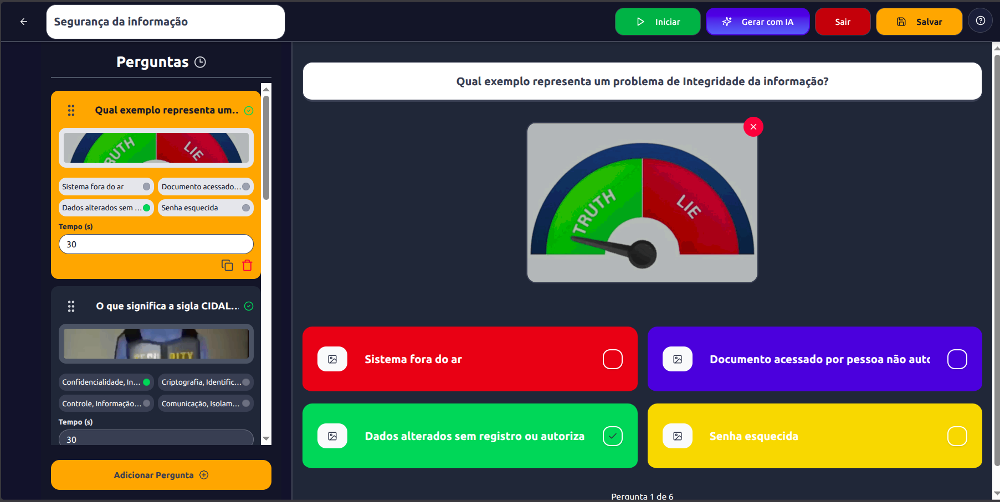
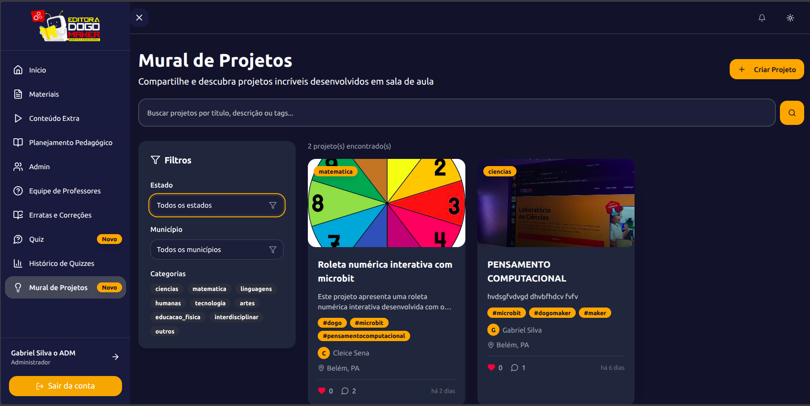
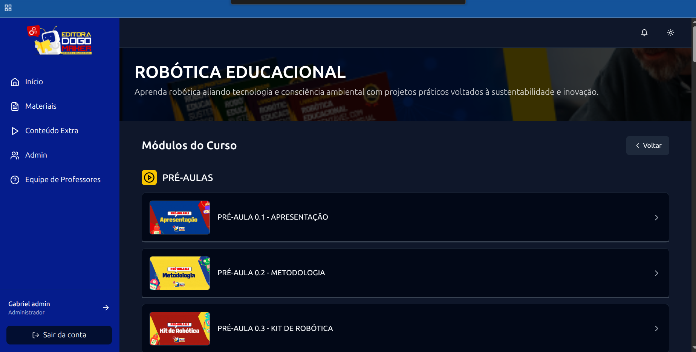
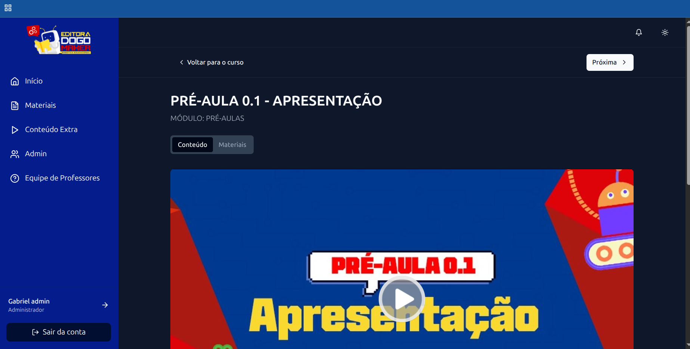

# 🌐 Plataforma de Comunicação e Capacitação Docente

Plataforma digital desenvolvida para fortalecer a comunicação interna e promover a capacitação contínua de professores em todo o Brasil. O sistema é uma aplicação **fullstack** construída de ponta a ponta, abrangendo backend, frontend, infraestrutura, monitoramento e deploy.

## 🏗️ Arquitetura Geral

O projeto foi desenhado com foco em **escalabilidade, segurança e performance**, utilizando uma abordagem modular:

* **Backend Modular:** Desenvolvido com NestJS.
* **Banco de Dados:** Relacional otimizado para grandes volumes.
* **Real-time:** Comunicação via WebSocket.
* **Cache:** Sincronização e performance com Redis.
* **Storage:** Armazenamento híbrido com S3 e Cloudflare.
* **Observabilidade:** Monitoramento completo com Prometheus e Grafana.
* **Infraestrutura:** Deploy containerizado com Docker.

---

## 🛠️ Stack Tecnológica

### 🔙 Backend

* **NestJS:** Framework modular para Node.js.
* **TypeORM:** Gerenciamento de banco com suporte a queries SQL customizadas.
* **PostgreSQL:** * Search Vector + Indexes (Full-Text Search).
* Queries otimizadas para dashboards.

* **Redis:** Cache, snapshots de sessões e sincronização em tempo real.
* **WebSocket:** Gateway NestJS para comunicação bidirecional.
* **Segurança:** Autenticação via Sessions/Cookies, AuthGuards e **RBAC** (Controle de acesso baseado em funções).
* **Testes & Docs:** Swagger (documentação) e Jest (testes unitários/integração).

### 🎨 Frontend

* **React.js + Vite:** Interface rápida e reativa.
* **Tailwind CSS & Radix UI:** Estilização moderna e componentes acessíveis.
* **React Query (TanStack):** Gerenciamento de estado de servidor e cache.
* **Context API:** Gestão de estado global e fluxo de autenticação.

### ☁️ Infraestrutura & DevOps

* **Orquestração:** Docker & Docker Compose.
* **Hospedagem:** Migração de Render para **VPS (Hostinger)** com gerenciamento via **EasyPanel**.
* **Integrações:** AWS S3 e Cloudflare R2 para entrega de mídia.

---

## 📊 Observabilidade e Monitoramento

A aplicação utiliza uma stack de monitoramento estruturada para garantir diagnóstico rápido e visibilidade de performance:

* **🔍 Prometheus:** Coleta métricas de CPU, Memória, tempo de resposta HTTP (Status Codes) e métricas de negócio (ex: quizzes ativos).
* **📈 Grafana:** Dashboards personalizados para visualização de usuários ativos e saúde da API em tempo real.

---

## 🚀 Funcionalidades Principais

| Funcionalidade | Descrição |
| --- | --- |
| **Gestão de Usuários** | Níveis de acesso (Admin, Professor, Aluno, Visitante) com RBAC. |
| **Dashboard Inteligente** | Métricas agregadas e filtros avançados via SQL otimizado. |
| **Quiz em Tempo Real** | Integração com **IA**, comunicação via WebSocket e persistência no Redis. |
| **Mural de Projetos** | Upload de mídias (S3/Cloudflare), likes, comentários e busca Full-Text. |
| **Área de Cursos** | Estrutura modular de aulas com controle de progresso. |

---

## 🧠 Desafios Técnicos Superados

* **Autenticação Segura:** Implementação robusta baseada em sessões.
* **Performance SQL:** Otimização de queries complexas e uso de Search Vectors no Postgres.
* **Sincronização Real-time:** Uso de WebSockets integrados ao Redis para manter a consistência.
* **DevOps:** Estruturação de ambiente multi-serviço em Docker e migração para VPS própria.

---

## 📷 Galeria de Imagens e Diagramas

- ✅ Interfaces principais do sistema (login, dashboard, painel do professor) (imagens autorizadas)

### 🎓 Painel Inicial

### 📊 Dashboard Principal

### 📊 Quiz em tempo real

> Quiz Interativo e em tempo real, para que os professores possam criar quizzes integrados com inteligência artificial e poder praticar com seus alunos.

Passei por diversos desafios técnicos, como:
- Utilização de websocket e sincronização de dados em tempo real e banco de dadoa via snapshot e redis.
- Integração com com api externas de imagem, gif e da openAI

### 📊 Mural de Projetos

> Desenvolvimento de um mural de projetos para professores subir seus projetos internos, com fotos, videos e arquivos.

Passei por diversos desafios técnicos, como:
- Utilização de Search Vector + Indexes do postgres, para fazer a busca eficiente e rápidas dos projetos.
- Integração com com api do S3 + Cloudflare Storage para o armazenamento das imagens e documentos.
- Utilização de Websocket para integrar notificações em tempo real para os usuarios que interagirem no projeto, como like e comentários.

### 📊 Detalhes do Curso

### 📊 Detalhes da aula

---

## 📈 Evoluções Futuras

* [ ] Implementação de **CI/CD** automatizado com GitHub Actions.
* [ ] Alertas de monitoramento via Telegram/Discord.
* [ ] Centralização de logs com **Loki**.

## 🤝 Contato
📧 gabriel23teotonio@gmail.com
🔗 [linkedin.com/in/gabriel-teotonio](https://linkedin.com/in/gabriel-teotonio)  
